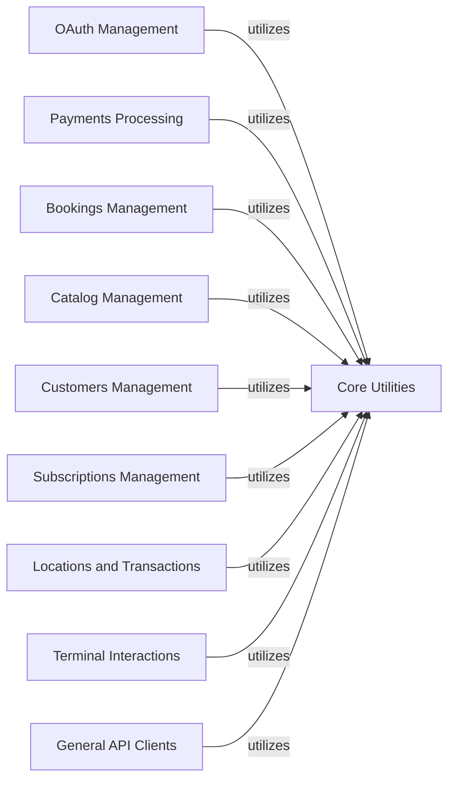

## Component Details

This graph provides an overview of the Square SDK's API service modules. These modules are organized into distinct components, each dedicated to a specific Square API category (e.g., Payments, Bookings, Customers). Each API-specific component encapsulates the business logic for interacting with its respective API endpoints. All these specialized API client components rely on a shared 'Core Utilities' component, which provides foundational functionalities such as HTTP response handling, API error processing, data serialization, and pagination.

### OAuth Management
This component provides functionalities for managing OAuth tokens, including obtaining, revoking, and retrieving token status, as well as authorizing applications. It includes both synchronous and asynchronous clients.

**Related Classes/Methods**:

- <a href="https://github.com/square/square-python-sdk/blob/master/src/square/o_auth/client.py#L17-L312" target="_blank" rel="noopener noreferrer">`square.o_auth.client.OAuthClient` (17:312)</a>
- <a href="https://github.com/square/square-python-sdk/blob/master/src/square/o_auth/raw_client.py#L20-L329" target="_blank" rel="noopener noreferrer">`square.o_auth.raw_client.RawOAuthClient` (20:329)</a>
- <a href="https://github.com/square/square-python-sdk/blob/master/src/square/o_auth/client.py#L315-L642" target="_blank" rel="noopener noreferrer">`square.o_auth.client.AsyncOAuthClient` (315:642)</a>
- <a href="https://github.com/square/square-python-sdk/blob/master/src/square/o_auth/raw_client.py#L332-L641" target="_blank" rel="noopener noreferrer">`square.o_auth.raw_client.AsyncRawOAuthClient` (332:641)</a>

### Payments Processing
This component handles all payment-related operations, such as creating, listing, updating, canceling, and completing payments. It also supports canceling payments by idempotency key. Both synchronous and asynchronous interfaces are available.

**Related Classes/Methods**:

- `square.payments.client.PaymentsClient` (full file reference)
- `square.payments.raw_client.RawPaymentsClient` (full file reference)
- `square.payments.client.AsyncPaymentsClient` (full file reference)
- `square.payments.raw_client.AsyncRawPaymentsClient` (full file reference)

### Bookings Management
This component manages booking-related functionalities, including creating, listing, updating, and canceling bookings. It also provides interfaces for searching availability, retrieving business and location booking profiles, and managing custom attributes related to bookings.

**Related Classes/Methods**:

- `square.bookings.client.BookingsClient` (full file reference)
- <a href="https://github.com/square/square-python-sdk/blob/master/src/square/bookings/raw_client.py#L30-L494" target="_blank" rel="noopener noreferrer">`square.bookings.raw_client.RawBookingsClient` (30:494)</a>
- <a href="https://github.com/square/square-python-sdk/blob/master/src/square/bookings/custom_attribute_definitions/client.py#L28-L335" target="_blank" rel="noopener noreferrer">`square.bookings.custom_attribute_definitions.client.CustomAttributeDefinitionsClient` (28:335)</a>
- <a href="https://github.com/square/square-python-sdk/blob/master/src/square/bookings/custom_attributes/client.py#L30-L403" target="_blank" rel="noopener noreferrer">`square.bookings.custom_attributes.client.CustomAttributesClient` (30:403)</a>
- <a href="https://github.com/square/square-python-sdk/blob/master/src/square/bookings/location_profiles/client.py#L18-L103" target="_blank" rel="noopener noreferrer">`square.bookings.location_profiles.client.LocationProfilesClient` (18:103)</a>
- <a href="https://github.com/square/square-python-sdk/blob/master/src/square/bookings/team_member_profiles/client.py#L19-L149" target="_blank" rel="noopener noreferrer">`square.bookings.team_member_profiles.client.TeamMemberProfilesClient` (19:149)</a>
- `square.bookings.client.AsyncBookingsClient` (full file reference)
- <a href="https://github.com/square/square-python-sdk/blob/master/src/square/bookings/raw_client.py#L497-L961" target="_blank" rel="noopener noreferrer">`square.bookings.raw_client.AsyncRawBookingsClient` (497:961)</a>
- <a href="https://github.com/square/square-python-sdk/blob/master/src/square/bookings/custom_attribute_definitions/client.py#L338-L685" target="_blank" rel="noopener noreferrer">`square.bookings.custom_attribute_definitions.client.AsyncCustomAttributeDefinitionsClient` (338:685)</a>
- <a href="https://github.com/square/square-python-sdk/blob/master/src/square/bookings/custom_attributes/client.py#L406-L827" target="_blank" rel="noopener noreferrer">`square.bookings.custom_attributes.client.AsyncCustomAttributesClient` (406:827)</a>
- <a href="https://github.com/square/square-python-sdk/blob/master/src/square/bookings/location_profiles/client.py#L106-L199" target="_blank" rel="noopener noreferrer">`square.bookings.location_profiles.client.AsyncLocationProfilesClient` (106:199)</a>
- <a href="https://github.com/square/square-python-sdk/blob/master/src/square/bookings/team_member_profiles/client.py#L152-L298" target="_blank" rel="noopener noreferrer">`square.bookings.team_member_profiles.client.AsyncTeamMemberProfilesClient` (152:298)</a>
- <a href="https://github.com/square/square-python-sdk/blob/master/src/square/bookings/custom_attribute_definitions/raw_client.py#L26-L280" target="_blank" rel="noopener noreferrer">`square.bookings.custom_attribute_definitions.raw_client.RawCustomAttributeDefinitionsClient` (26:280)</a>
- <a href="https://github.com/square/square-python-sdk/blob/master/src/square/bookings/custom_attribute_definitions/raw_client.py#L283-L537" target="_blank" rel="noopener noreferrer">`square.bookings.custom_attribute_definitions.raw_client.AsyncRawCustomAttributeDefinitionsClient` (283:537)</a>
- <a href="https://github.com/square/square-python-sdk/blob/master/src/square/bookings/location_profiles/raw_client.py#L7-L9" target="_blank" rel="noopener noreferrer">`square.bookings.location_profiles.raw_client.RawLocationProfilesClient` (7:9)</a>
- <a href="https://github.com/square/square-python-sdk/blob/master/src/square/bookings/location_profiles/raw_client.py#L12-L14" target="_blank" rel="noopener noreferrer">`square.bookings.location_profiles.raw_client.AsyncRawLocationProfilesClient` (12:14)</a>
- <a href="https://github.com/square/square-python-sdk/blob/master/src/square/bookings/team_member_profiles/raw_client.py#L16-L57" target="_blank" rel="noopener noreferrer">`square.bookings.team_member_profiles.raw_client.RawTeamMemberProfilesClient` (16:57)</a>
- <a href="https://github.com/square/square-python-sdk/blob/master/src/square/bookings/team_member_profiles/raw_client.py#L60-L101" target="_blank" rel="noopener noreferrer">`square.bookings.team_member_profiles.raw_client.AsyncRawTeamMemberProfilesClient` (60:101)</a>
- <a href="https://github.com/square/square-python-sdk/blob/master/src/square/bookings/custom_attributes/raw_client.py#L27-L349" target="_blank" rel="noopener noreferrer">`square.bookings.custom_attributes.raw_client.RawCustomAttributesClient` (27:349)</a>
- <a href="https://github.com/square/square-python-sdk/blob/master/src/square/bookings/custom_attributes/raw_client.py#L352-L674" target="_blank" rel="noopener noreferrer">`square.bookings.custom_attributes.raw_client.AsyncRawCustomAttributesClient` (352:674)</a>

### Catalog Management
This component is responsible for managing a merchant's catalog, including batch operations for deleting, retrieving, and upserting catalog objects. It also provides functionalities for searching catalog items and updating item modifier lists and taxes.

**Related Classes/Methods**:

- `square.catalog.client.CatalogClient` (full file reference)
- `square.catalog.raw_client.RawCatalogClient` (full file reference)
- <a href="https://github.com/square/square-python-sdk/blob/master/src/square/catalog/images/client.py#L19-L122" target="_blank" rel="noopener noreferrer">`square.catalog.images.client.ImagesClient` (19:122)</a>
- <a href="https://github.com/square/square-python-sdk/blob/master/src/square/catalog/object/client.py#L18-L213" target="_blank" rel="noopener noreferrer">`square.catalog.object.client.ObjectClient` (18:213)</a>
- `square.catalog.client.AsyncCatalogClient` (full file reference)
- `square.catalog.raw_client.AsyncRawCatalogClient` (full file reference)
- <a href="https://github.com/square/square-python-sdk/blob/master/src/square/catalog/images/client.py#L125-L246" target="_blank" rel="noopener noreferrer">`square.catalog.images.client.AsyncImagesClient` (125:246)</a>
- <a href="https://github.com/square/square-python-sdk/blob/master/src/square/catalog/object/client.py#L216-L435" target="_blank" rel="noopener noreferrer">`square.catalog.object.client.AsyncObjectClient` (216:435)</a>
- <a href="https://github.com/square/square-python-sdk/blob/master/src/square/catalog/images/raw_client.py#L24-L156" target="_blank" rel="noopener noreferrer">`square.catalog.images.raw_client.RawImagesClient` (24:156)</a>
- <a href="https://github.com/square/square-python-sdk/blob/master/src/square/catalog/images/raw_client.py#L159-L291" target="_blank" rel="noopener noreferrer">`square.catalog.images.raw_client.AsyncRawImagesClient` (159:291)</a>

### Customers Management
This component handles customer-related operations, such as creating, listing, updating, and deleting customer profiles. It also supports batch operations for customers, managing customer groups, segments, cards, and custom attributes.

**Related Classes/Methods**:

- `square.customers.client.CustomersClient` (full file reference)
- `square.customers.raw_client.RawCustomersClient` (full file reference)
- <a href="https://github.com/square/square-python-sdk/blob/master/src/square/customers/custom_attribute_definitions/client.py#L36-L432" target="_blank" rel="noopener noreferrer">`square.customers.custom_attribute_definitions.client.CustomAttributeDefinitionsClient` (36:432)</a>
- <a href="https://github.com/square/square-python-sdk/blob/master/src/square/customers/groups/client.py#L28-L346" target="_blank" rel="noopener noreferrer">`square.customers.groups.client.GroupsClient` (28:346)</a>
- <a href="https://github.com/square/square-python-sdk/blob/master/src/square/customers/segments/client.py#L19-L143" target="_blank" rel="noopener noreferrer">`square.customers.segments.client.SegmentsClient` (19:143)</a>
- <a href="https://github.com/square/square-python-sdk/blob/master/src/square/customers/cards/client.py#L17-L153" target="_blank" rel="noopener noreferrer">`square.customers.cards.client.CardsClient` (17:153)</a>
- <a href="https://github.com/square/square-python-sdk/blob/master/src/square/customers/custom_attributes/client.py#L26-L319" target="_blank" rel="noopener noreferrer">`square.customers.custom_attributes.client.CustomAttributesClient` (26:319)</a>
- `square.customers.client.AsyncCustomersClient` (full file reference)
- `square.customers.raw_client.AsyncRawCustomersClient` (full file reference)
- <a href="https://github.com/square/square-python-sdk/blob/master/src/square/customers/custom_attribute_definitions/client.py#L435-L882" target="_blank" rel="noopener noreferrer">`square.customers.custom_attribute_definitions.client.AsyncCustomAttributeDefinitionsClient` (435:882)</a>
- <a href="https://github.com/square/square-python-sdk/blob/master/src/square/customers/groups/client.py#L349-L723" target="_blank" rel="noopener noreferrer">`square.customers.groups.client.AsyncGroupsClient` (349:723)</a>
- <a href="https://github.com/square/square-python-sdk/blob/master/src/square/customers/segments/client.py#L146-L286" target="_blank" rel="noopener noreferrer">`square.customers.segments.client.AsyncSegmentsClient` (146:286)</a>
- <a href="https://github.com/square/square-python-sdk/blob/master/src/square/customers/cards/client.py#L156-L308" target="_blank" rel="noopener noreferrer">`square.customers.cards.client.AsyncCardsClient` (156:308)</a>
- <a href="https://github.com/square/square-python-sdk/blob/master/src/square/customers/custom_attributes/client.py#L322-L647" target="_blank" rel="noopener noreferrer">`square.customers.custom_attributes.client.AsyncCustomAttributesClient` (322:647)</a>

### Subscriptions Management
This component manages customer subscriptions, including creating, updating, canceling, pausing, resuming, and swapping subscription plans. It also allows searching for subscriptions and listing subscription events.

**Related Classes/Methods**:

- `square.subscriptions.client.SubscriptionsClient` (full file reference)
- `square.subscriptions.raw_client.RawSubscriptionsClient` (full file reference)
- `square.subscriptions.client.AsyncSubscriptionsClient` (full file reference)
- `square.subscriptions.raw_client.AsyncRawSubscriptionsClient` (full file reference)

### Locations and Transactions
This component handles operations related to business locations, including listing, creating, retrieving, and updating locations. It also provides functionalities for managing transactions and checkouts associated with locations.

**Related Classes/Methods**:

- <a href="https://github.com/square/square-python-sdk/blob/master/src/square/locations/client.py#L29-L429" target="_blank" rel="noopener noreferrer">`square.locations.client.LocationsClient` (29:429)</a>
- <a href="https://github.com/square/square-python-sdk/blob/master/src/square/locations/raw_client.py#L28-L375" target="_blank" rel="noopener noreferrer">`square.locations.raw_client.RawLocationsClient` (28:375)</a>
- <a href="https://github.com/square/square-python-sdk/blob/master/src/square/locations/custom_attribute_definitions/client.py#L35-L344" target="_blank" rel="noopener noreferrer">`square.locations.custom_attribute_definitions.client.CustomAttributeDefinitionsClient` (35:344)</a>
- <a href="https://github.com/square/square-python-sdk/blob/master/src/square/locations/custom_attributes/client.py#L35-L431" target="_blank" rel="noopener noreferrer">`square.locations.custom_attributes.client.CustomAttributesClient` (35:431)</a>
- <a href="https://github.com/square/square-python-sdk/blob/master/src/square/locations/transactions/client.py#L16-L228" target="_blank" rel="noopener noreferrer">`square.locations.transactions.client.TransactionsClient` (16:228)</a>
- <a href="https://github.com/square/square-python-sdk/blob/master/src/square/locations/client.py#L432-L876" target="_blank" rel="noopener noreferrer">`square.locations.client.AsyncLocationsClient` (432:876)</a>
- <a href="https://github.com/square/square-python-sdk/blob/master/src/square/locations/raw_client.py#L378-L727" target="_blank" rel="noopener noreferrer">`square.locations.raw_client.AsyncRawLocationsClient` (378:727)</a>
- <a href="https://github.com/square/square-python-sdk/blob/master/src/square/locations/custom_attribute_definitions/client.py#L347-L696" target="_blank" rel="noopener noreferrer">`square.locations.custom_attribute_definitions.client.AsyncCustomAttributeDefinitionsClient` (347:696)</a>
- <a href="https://github.com/square/square-python-sdk/blob/master/src/square/locations/custom_attributes/client.py#L434-L878" target="_blank" rel="noopener noreferrer">`square.locations.custom_attributes.client.AsyncCustomAttributesClient` (434:878)</a>
- <a href="https://github.com/square/square-python-sdk/blob/master/src/square/locations/transactions/client.py#L231-L475" target="_blank" rel="noopener noreferrer">`square.locations.transactions.client.AsyncTransactionsClient` (231:475)</a>

### Terminal Interactions
This component facilitates interactions with Square Terminal devices, allowing for the dismissal of terminal actions, checkouts, and refunds. It provides interfaces for managing these terminal-specific operations.

**Related Classes/Methods**:

- <a href="https://github.com/square/square-python-sdk/blob/master/src/square/terminal/client.py#L20-L139" target="_blank" rel="noopener noreferrer">`square.terminal.client.TerminalClient` (20:139)</a>
- <a href="https://github.com/square/square-python-sdk/blob/master/src/square/terminal/raw_client.py#L18-L139" target="_blank" rel="noopener noreferrer">`square.terminal.raw_client.RawTerminalClient` (18:139)</a>
- <a href="https://github.com/square/square-python-sdk/blob/master/src/square/terminal/actions/client.py#L20-L206" target="_blank" rel="noopener noreferrer">`square.terminal.actions.client.ActionsClient` (20:206)</a>
- <a href="https://github.com/square/square-python-sdk/blob/master/src/square/terminal/checkouts/client.py#L20-L199" target="_blank" rel="noopener noreferrer">`square.terminal.checkouts.client.CheckoutsClient` (20:199)</a>
- <a href="https://github.com/square/square-python-sdk/blob/master/src/square/terminal/refunds/client.py#L20-L198" target="_blank" rel="noopener noreferrer">`square.terminal.refunds.client.RefundsClient` (20:198)</a>
- <a href="https://github.com/square/square-python-sdk/blob/master/src/square/terminal/client.py#L142-L285" target="_blank" rel="noopener noreferrer">`square.terminal.client.AsyncTerminalClient` (142:285)</a>
- <a href="https://github.com/square/square-python-sdk/blob/master/src/square/terminal/raw_client.py#L142-L263" target="_blank" rel="noopener noreferrer">`square.terminal.raw_client.AsyncRawTerminalClient` (142:263)</a>
- <a href="https://github.com/square/square-python-sdk/blob/master/src/square/terminal/actions/client.py#L209-L429" target="_blank" rel="noopener noreferrer">`square.terminal.actions.client.AsyncActionsClient` (209:429)</a>
- <a href="https://github.com/square/square-python-sdk/blob/master/src/square/terminal/checkouts/client.py#L202-L417" target="_blank" rel="noopener noreferrer">`square.terminal.checkouts.client.AsyncCheckoutsClient` (202:417)</a>
- <a href="https://github.com/square/square-python-sdk/blob/master/src/square/terminal/refunds/client.py#L201-L413" target="_blank" rel="noopener noreferrer">`square.terminal.refunds.client.AsyncRefundsClient` (201:413)</a>

### Core Utilities
This foundational component provides essential utilities for the SDK, including handling unchecked base models, managing HTTP responses (both synchronous and asynchronous), processing API errors, performing serialization, encoding JSON, and facilitating pagination for list operations.

**Related Classes/Methods**:

- <a href="https://github.com/square/square-python-sdk/blob/master/src/square/core/unchecked_base_model.py#L171-L269" target="_blank" rel="noopener noreferrer">`square.core.unchecked_base_model.construct_type` (171:269)</a>
- <a href="https://github.com/square/square-python-sdk/blob/master/src/square/core/http_response.py#L10-L27" target="_blank" rel="noopener noreferrer">`square.core.http_response.HttpResponse` (10:27)</a>
- <a href="https://github.com/square/square-python-sdk/blob/master/src/square/core/api_error.py#L14-L123" target="_blank" rel="noopener noreferrer">`square.core.api_error.ApiError` (14:123)</a>
- <a href="https://github.com/square/square-python-sdk/blob/master/src/square/core/http_response.py#L30-L47" target="_blank" rel="noopener noreferrer">`square.core.http_response.AsyncHttpResponse` (30:47)</a>
- <a href="https://github.com/square/square-python-sdk/blob/master/src/square/core/pagination.py#L37-L62" target="_blank" rel="noopener noreferrer">`square.core.pagination.SyncPager` (37:62)</a>
- <a href="https://github.com/square/square-python-sdk/blob/master/src/square/core/pagination.py#L65-L87" target="_blank" rel="noopener noreferrer">`square.core.pagination.AsyncPager` (65:87)</a>
- <a href="https://github.com/square/square-python-sdk/blob/master/src/square/core/serialization.py#L29-L154" target="_blank" rel="noopener noreferrer">`square.core.serialization.convert_and_respect_annotation_metadata` (29:154)</a>
- <a href="https://github.com/square/square-python-sdk/blob/master/src/square/core/jsonable_encoder.py#L31-L100" target="_blank" rel="noopener noreferrer">`square.core.jsonable_encoder.jsonable_encoder` (31:100)</a>

### General API Clients
This component groups various other top-level API clients that interact with different Square API domains, such as Webhooks, Inventory, Team Members, Orders, Cards, and Checkout. These clients provide a wide range of functionalities specific to their respective domains.

**Related Classes/Methods**:

- <a href="https://github.com/square/square-python-sdk/blob/master/src/square/webhooks/client.py#L13-L29" target="_blank" rel="noopener noreferrer">`square.webhooks.client.WebhooksClient` (13:29)</a>
- <a href="https://github.com/square/square-python-sdk/blob/master/src/square/webhooks/raw_client.py#L7-L9" target="_blank" rel="noopener noreferrer">`square.webhooks.raw_client.RawWebhooksClient` (7:9)</a>
- <a href="https://github.com/square/square-python-sdk/blob/master/src/square/webhooks/event_types/client.py#L12-L56" target="_blank" rel="noopener noreferrer">`square.webhooks.event_types.client.EventTypesClient` (12:56)</a>
- <a href="https://github.com/square/square-python-sdk/blob/master/src/square/webhooks/subscriptions/client.py#L29-L378" target="_blank" rel="noopener noreferrer">`square.webhooks.subscriptions.client.SubscriptionsClient` (29:378)</a>
- <a href="https://github.com/square/square-python-sdk/blob/master/src/square/webhooks/client.py#L32-L48" target="_blank" rel="noopener noreferrer">`square.webhooks.client.AsyncWebhooksClient` (32:48)</a>
- <a href="https://github.com/square/square-python-sdk/blob/master/src/square/webhooks/raw_client.py#L12-L14" target="_blank" rel="noopener noreferrer">`square.webhooks.raw_client.AsyncRawWebhooksClient` (12:14)</a>
- <a href="https://github.com/square/square-python-sdk/blob/master/src/square/webhooks/event_types/client.py#L59-L111" target="_blank" rel="noopener noreferrer">`square.webhooks.event_types.client.AsyncEventTypesClient` (59:111)</a>
- <a href="https://github.com/square/square-python-sdk/blob/master/src/square/webhooks/subscriptions/client.py#L381-L788" target="_blank" rel="noopener noreferrer">`square.webhooks.subscriptions.client.AsyncSubscriptionsClient` (381:788)</a>
- `square.inventory.client.InventoryClient` (full file reference)
- `square.inventory.raw_client.RawInventoryClient` (full file reference)
- `square.inventory.client.AsyncInventoryClient` (full file reference)
- `square.inventory.raw_client.AsyncRawInventoryClient` (full file reference)
- <a href="https://github.com/square/square-python-sdk/blob/master/src/square/team_members/client.py#L26-L419" target="_blank" rel="noopener noreferrer">`square.team_members.client.TeamMembersClient` (26:419)</a>
- <a href="https://github.com/square/square-python-sdk/blob/master/src/square/team_members/raw_client.py#L29-L373" target="_blank" rel="noopener noreferrer">`square.team_members.raw_client.RawTeamMembersClient` (29:373)</a>
- <a href="https://github.com/square/square-python-sdk/blob/master/src/square/team_members/wage_setting/client.py#L17-L135" target="_blank" rel="noopener noreferrer">`square.team_members.wage_setting.client.WageSettingClient` (17:135)</a>
- <a href="https://github.com/square/square-python-sdk/blob/master/src/square/team_members/client.py#L422-L869" target="_blank" rel="noopener noreferrer">`square.team_members.client.AsyncTeamMembersClient` (422:869)</a>
- <a href="https://github.com/square/square-python-sdk/blob/master/src/square/team_members/raw_client.py#L376-L720" target="_blank" rel="noopener noreferrer">`square.team_members.raw_client.AsyncRawTeamMembersClient` (376:720)</a>
- <a href="https://github.com/square/square-python-sdk/blob/master/src/square/team_members/wage_setting/client.py#L138-L274" target="_blank" rel="noopener noreferrer">`square.team_members.wage_setting.client.AsyncWageSettingClient` (138:274)</a>
- `square.orders.client.OrdersClient` (full file reference)
- `square.orders.raw_client.RawOrdersClient` (full file reference)
- <a href="https://github.com/square/square-python-sdk/blob/master/src/square/orders/custom_attribute_definitions/client.py#L27-L329" target="_blank" rel="noopener noreferrer">`square.orders.custom_attribute_definitions.client.CustomAttributeDefinitionsClient` (27:329)</a>
- <a href="https://github.com/square/square-python-sdk/blob/master/src/square/orders/custom_attributes/client.py#L35-L457" target="_blank" rel="noopener noreferrer">`square.orders.custom_attributes.client.CustomAttributesClient` (35:457)</a>
- `square.orders.client.AsyncOrdersClient` (full file reference)
- `square.orders.raw_client.AsyncRawOrdersClient` (full file reference)
- <a href="https://github.com/square/square-python-sdk/blob/master/src/square/orders/custom_attribute_definitions/client.py#L332-L674" target="_blank" rel="noopener noreferrer">`square.orders.custom_attribute_definitions.client.AsyncCustomAttributeDefinitionsClient` (332:674)</a>
- <a href="https://github.com/square/square-python-sdk/blob/master/src/square/orders/custom_attributes/client.py#L460-L930" target="_blank" rel="noopener noreferrer">`square.orders.custom_attributes.client.AsyncCustomAttributesClient` (460:930)</a>
- <a href="https://github.com/square/square-python-sdk/blob/master/src/square/cards/client.py#L26-L276" target="_blank" rel="noopener noreferrer">`square.cards.client.CardsClient` (26:276)</a>
- <a href="https://github.com/square/square-python-sdk/blob/master/src/square/cards/raw_client.py#L23-L177" target="_blank" rel="noopener noreferrer">`square.cards.raw_client.RawCardsClient` (23:177)</a>
- <a href="https://github.com/square/square-python-sdk/blob/master/src/square/cards/client.py#L279-L563" target="_blank" rel="noopener noreferrer">`square.cards.client.AsyncCardsClient` (279:563)</a>
- <a href="https://github.com/square/square-python-sdk/blob/master/src/square/cards/raw_client.py#L180-L334" target="_blank" rel="noopener noreferrer">`square.cards.raw_client.AsyncRawCardsClient` (180:334)</a>
- <a href="https://github.com/square/square-python-sdk/blob/master/src/square/checkout/client.py#L22-L178" target="_blank" rel="noopener noreferrer">`square.checkout.client.CheckoutClient` (22:178)</a>
- <a href="https://github.com/square/square-python-sdk/blob/master/src/square/checkout/raw_client.py#L25-L208" target="_blank" rel="noopener noreferrer">`square.checkout.raw_client.RawCheckoutClient` (25:208)</a>
- <a href="https://github.com/square/square-python-sdk/blob/master/src/square/checkout/payment_links/client.py#L30-L313" target="_blank" rel="noopener noreferrer">`square.checkout.payment_links.client.PaymentLinksClient` (30:313)</a>
- <a href="https://github.com/square/square-python-sdk/blob/master/src/square/checkout/client.py#L181-L369" target="_blank" rel="noopener noreferrer">`square.checkout.client.AsyncCheckoutClient` (181:369)</a>
- <a href="https://github.com/square/square-python-sdk/blob/master/src/square/checkout/raw_client.py#L211-L394" target="_blank" rel="noopener noreferrer">`square.checkout.raw_client.AsyncRawCheckoutClient` (211:394)</a>
- <a href="https://github.com/square/square-python-sdk/blob/master/src/square/checkout/payment_links/client.py#L316-L641" target="_blank" rel="noopener noreferrer">`square.checkout.payment_links.client.AsyncPaymentLinksClient` (316:641)</a>

### [FAQ](https://github.com/CodeBoarding/GeneratedOnBoardings/tree/main?tab=readme-ov-file#faq)