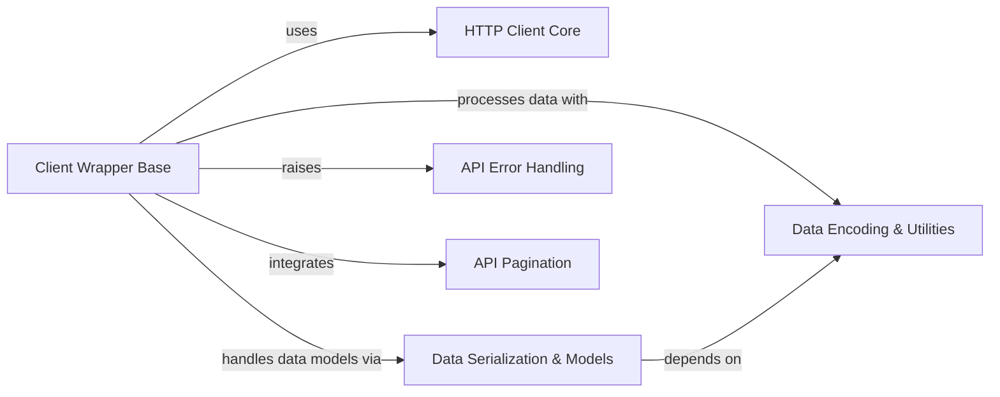

## Component Details

The 'Core Communication & Utilities' component serves as the foundational layer for the entire SDK, providing essential services for interacting with the Square API. Its primary purpose is to abstract the complexities of HTTP communication, data handling, error management, and pagination, allowing higher-level API-specific components to focus on business logic. This component ensures reliable and efficient data exchange, proper serialization and deserialization of various data types, and a consistent approach to error reporting and paginated results across the SDK.

### HTTP Client Core
Manages the execution of synchronous and asynchronous HTTP requests and responses, forming the lowest level of network communication within the SDK.

**Related Classes/Methods**:

- <a href="https://github.com/square/square-python-sdk/blob/master/src/square/core/http_client.py#L148-L321" target="_blank" rel="noopener noreferrer">`square.core.http_client.HttpClient` (148:321)</a>
- <a href="https://github.com/square/square-python-sdk/blob/master/src/square/core/http_client.py#L324-L497" target="_blank" rel="noopener noreferrer">`square.core.http_client.AsyncHttpClient` (324:497)</a>

### Client Wrapper Base
Provides a foundational layer for all API clients, abstracting the underlying HTTP communication and integrating core utilities for request and response handling.

**Related Classes/Methods**:

- <a href="https://github.com/square/square-python-sdk/blob/master/src/square/core/client_wrapper.py#L9-L46" target="_blank" rel="noopener noreferrer">`square.core.client_wrapper.BaseClientWrapper` (9:46)</a>
- <a href="https://github.com/square/square-python-sdk/blob/master/src/square/core/client_wrapper.py#L49-L65" target="_blank" rel="noopener noreferrer">`square.core.client_wrapper.SyncClientWrapper` (49:65)</a>
- <a href="https://github.com/square/square-python-sdk/blob/master/src/square/core/client_wrapper.py#L68-L84" target="_blank" rel="noopener noreferrer">`square.core.client_wrapper.AsyncClientWrapper` (68:84)</a>

### Data Encoding & Utilities
Responsible for encoding various data types, such as query parameters and file uploads, into formats suitable for HTTP requests, and provides general utility functions for data manipulation like removing None values.

**Related Classes/Methods**:

- `square.core.query_encoder` (full file reference)
- `square.core.file` (full file reference)
- <a href="https://github.com/square/square-python-sdk/blob/master/src/square/core/remove_none_from_dict.py#L6-L11" target="_blank" rel="noopener noreferrer">`square.core.remove_none_from_dict` (6:11)</a>
- <a href="https://github.com/square/square-python-sdk/blob/master/src/square/core/jsonable_encoder.py#L31-L100" target="_blank" rel="noopener noreferrer">`square.core.jsonable_encoder` (31:100)</a>

### Data Serialization & Models
Handles the complex serialization and deserialization of data, particularly for Pydantic models, and provides utilities for working with these models and datetime objects, ensuring data integrity and proper formatting.

**Related Classes/Methods**:

- <a href="https://github.com/square/square-python-sdk/blob/master/src/square/core/unchecked_base_model.py#L36-L124" target="_blank" rel="noopener noreferrer">`square.core.unchecked_base_model.UncheckedBaseModel` (36:124)</a>
- `square.core.serialization` (full file reference)
- `square.core.pydantic_utilities` (full file reference)
- `square.core.datetime_utils` (full file reference)

### API Error Handling
Defines the structure for API-specific errors and provides mechanisms for their handling, allowing the SDK to gracefully manage and report issues encountered during API interactions.

**Related Classes/Methods**:

- <a href="https://github.com/square/square-python-sdk/blob/master/src/square/core/api_error.py#L14-L123" target="_blank" rel="noopener noreferrer">`square.core.api_error.ApiError` (14:123)</a>

### API Pagination
Provides helper classes for iterating over paginated API responses, simplifying the process of retrieving large datasets from the Square API in both synchronous and asynchronous contexts.

**Related Classes/Methods**:

- <a href="https://github.com/square/square-python-sdk/blob/master/src/square/core/pagination.py#L37-L62" target="_blank" rel="noopener noreferrer">`square.core.pagination.SyncPager` (37:62)</a>
- <a href="https://github.com/square/square-python-sdk/blob/master/src/square/core/pagination.py#L65-L87" target="_blank" rel="noopener noreferrer">`square.core.pagination.AsyncPager` (65:87)</a>

### [FAQ](https://github.com/CodeBoarding/GeneratedOnBoardings/tree/main?tab=readme-ov-file#faq)