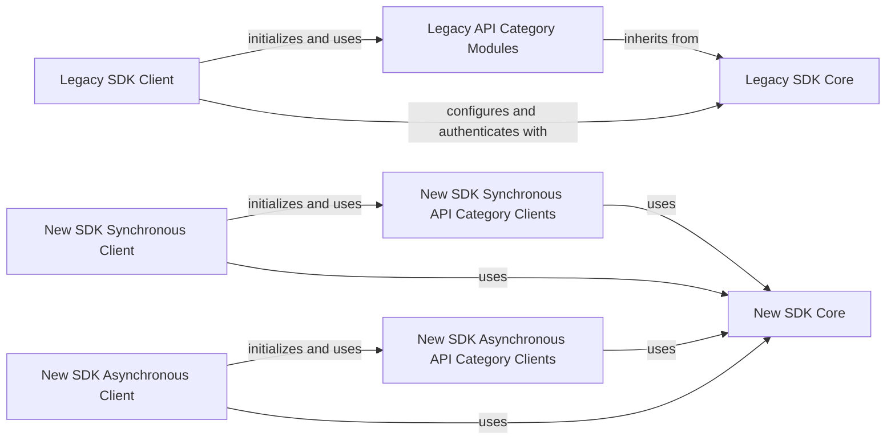

## Component Details

This graph illustrates the structure and interactions within the SDK Clients subsystem, which provides the primary interfaces for interacting with the Square API. It distinguishes between legacy and modern SDK approaches, offering both synchronous and asynchronous clients for the latter. The core purpose is to aggregate various API-specific modules and manage underlying HTTP communication and authentication, enabling developers to access Square's services programmatically.

### Legacy SDK Client
This component serves as the main entry point for interacting with the Square API using the legacy SDK. It initializes and provides access to various API categories (e.g., Mobile Authorization, OAuth, V1 Transactions, etc.) as lazy-loaded properties. It also handles global configuration and OAuth2 authentication.

**Related Classes/Methods**:

- <a href="https://github.com/square/square-python-sdk/blob/master/legacy/src/square_legacy/client.py#L55-L269" target="_blank" rel="noopener noreferrer">`square_legacy.client.Client` (55:269)</a>
- <a href="https://github.com/square/square-python-sdk/blob/master/legacy/src/square_legacy/client.py#L235-L269" target="_blank" rel="noopener noreferrer">`square_legacy.client.Client:__init__` (235:269)</a>
- <a href="https://github.com/square/square-python-sdk/blob/master/legacy/src/square_legacy/client.py#L68-L69" target="_blank" rel="noopener noreferrer">`square_legacy.client.Client:mobile_authorization` (68:69)</a>
- <a href="https://github.com/square/square-python-sdk/blob/master/legacy/src/square_legacy/client.py#L72-L73" target="_blank" rel="noopener noreferrer">`square_legacy.client.Client:o_auth` (72:73)</a>
- <a href="https://github.com/square/square-python-sdk/blob/master/legacy/src/square_legacy/client.py#L76-L77" target="_blank" rel="noopener noreferrer">`square_legacy.client.Client:v1_transactions` (76:77)</a>
- <a href="https://github.com/square/square-python-sdk/blob/master/legacy/src/square_legacy/client.py#L80-L81" target="_blank" rel="noopener noreferrer">`square_legacy.client.Client:apple_pay` (80:81)</a>
- <a href="https://github.com/square/square-python-sdk/blob/master/legacy/src/square_legacy/client.py#L84-L85" target="_blank" rel="noopener noreferrer">`square_legacy.client.Client:bank_accounts` (84:85)</a>
- <a href="https://github.com/square/square-python-sdk/blob/master/legacy/src/square_legacy/client.py#L88-L89" target="_blank" rel="noopener noreferrer">`square_legacy.client.Client:bookings` (88:89)</a>
- <a href="https://github.com/square/square-python-sdk/blob/master/legacy/src/square_legacy/client.py#L92-L93" target="_blank" rel="noopener noreferrer">`square_legacy.client.Client:booking_custom_attributes` (92:93)</a>
- <a href="https://github.com/square/square-python-sdk/blob/master/legacy/src/square_legacy/client.py#L96-L97" target="_blank" rel="noopener noreferrer">`square_legacy.client.Client:cards` (96:97)</a>
- <a href="https://github.com/square/square-python-sdk/blob/master/legacy/src/square_legacy/client.py#L100-L101" target="_blank" rel="noopener noreferrer">`square_legacy.client.Client:cash_drawers` (100:101)</a>
- <a href="https://github.com/square/square-python-sdk/blob/master/legacy/src/square_legacy/client.py#L104-L105" target="_blank" rel="noopener noreferrer">`square_legacy.client.Client:catalog` (104:105)</a>
- <a href="https://github.com/square/square-python-sdk/blob/master/legacy/src/square_legacy/client.py#L108-L109" target="_blank" rel="noopener noreferrer">`square_legacy.client.Client:customers` (108:109)</a>
- <a href="https://github.com/square/square-python-sdk/blob/master/legacy/src/square_legacy/client.py#L112-L113" target="_blank" rel="noopener noreferrer">`square_legacy.client.Client:customer_custom_attributes` (112:113)</a>
- <a href="https://github.com/square/square-python-sdk/blob/master/legacy/src/square_legacy/client.py#L116-L117" target="_blank" rel="noopener noreferrer">`square_legacy.client.Client:customer_groups` (116:117)</a>
- <a href="https://github.com/square/square-python-sdk/blob/master/legacy/src/square_legacy/client.py#L120-L121" target="_blank" rel="noopener noreferrer">`square_legacy.client.Client:customer_segments` (120:121)</a>
- <a href="https://github.com/square/square-python-sdk/blob/master/legacy/src/square_legacy/client.py#L124-L125" target="_blank" rel="noopener noreferrer">`square_legacy.client.Client:devices` (124:125)</a>
- <a href="https://github.com/square/square-python-sdk/blob/master/legacy/src/square_legacy/client.py#L128-L129" target="_blank" rel="noopener noreferrer">`square_legacy.client.Client:disputes` (128:129)</a>
- <a href="https://github.com/square/square-python-sdk/blob/master/legacy/src/square_legacy/client.py#L132-L133" target="_blank" rel="noopener noreferrer">`square_legacy.client.Client:employees` (132:133)</a>
- <a href="https://github.com/square/square-python-sdk/blob/master/legacy/src/square_legacy/client.py#L136-L137" target="_blank" rel="noopener noreferrer">`square_legacy.client.Client:events` (136:137)</a>
- <a href="https://github.com/square/square-python-sdk/blob/master/legacy/src/square_legacy/client.py#L140-L141" target="_blank" rel="noopener noreferrer">`square_legacy.client.Client:gift_cards` (140:141)</a>
- <a href="https://github.com/square/square-python-sdk/blob/master/legacy/src/square_legacy/client.py#L144-L145" target="_blank" rel="noopener noreferrer">`square_legacy.client.Client:gift_card_activities` (144:145)</a>
- <a href="https://github.com/square/square-python-sdk/blob/master/legacy/src/square_legacy/client.py#L148-L149" target="_blank" rel="noopener noreferrer">`square_legacy.client.Client:inventory` (148:149)</a>
- <a href="https://github.com/square/square-python-sdk/blob/master/legacy/src/square_legacy/client.py#L152-L153" target="_blank" rel="noopener noreferrer">`square_legacy.client.Client:invoices` (152:153)</a>
- <a href="https://github.com/square/square-python-sdk/blob/master/legacy/src/square_legacy/client.py#L156-L157" target="_blank" rel="noopener noreferrer">`square_legacy.client.Client:labor` (156:157)</a>
- <a href="https://github.com/square/square-python-sdk/blob/master/legacy/src/square_legacy/client.py#L160-L161" target="_blank" rel="noopener noreferrer">`square_legacy.client.Client:locations` (160:161)</a>
- <a href="https://github.com/square/square-python-sdk/blob/master/legacy/src/square_legacy/client.py#L164-L165" target="_blank" rel="noopener noreferrer">`square_legacy.client.Client:location_custom_attributes` (164:165)</a>
- <a href="https://github.com/square/square-python-sdk/blob/master/legacy/src/square_legacy/client.py#L168-L169" target="_blank" rel="noopener noreferrer">`square_legacy.client.Client:checkout` (168:169)</a>
- <a href="https://github.com/square/square-python-sdk/blob/master/legacy/src/square_legacy/client.py#L172-L173" target="_blank" rel="noopener noreferrer">`square_legacy.client.Client:transactions` (172:173)</a>
- <a href="https://github.com/square/square-python-sdk/blob/master/legacy/src/square_legacy/client.py#L176-L177" target="_blank" rel="noopener noreferrer">`square_legacy.client.Client:loyalty` (176:177)</a>
- <a href="https://github.com/square/square-python-sdk/blob/master/legacy/src/square_legacy/client.py#L180-L181" target="_blank" rel="noopener noreferrer">`square_legacy.client.Client:merchants` (180:181)</a>
- <a href="https://github.com/square/square-python-sdk/blob/master/legacy/src/square_legacy/client.py#L184-L185" target="_blank" rel="noopener noreferrer">`square_legacy.client.Client:merchant_custom_attributes` (184:185)</a>
- <a href="https://github.com/square/square-python-sdk/blob/master/legacy/src/square_legacy/client.py#L188-L189" target="_blank" rel="noopener noreferrer">`square_legacy.client.Client:orders` (188:189)</a>
- <a href="https://github.com/square/square-python-sdk/blob/master/legacy/src/square_legacy/client.py#L192-L193" target="_blank" rel="noopener noreferrer">`square_legacy.client.Client:order_custom_attributes` (192:193)</a>
- <a href="https://github.com/square/square-python-sdk/blob/master/legacy/src/square_legacy/client.py#L196-L197" target="_blank" rel="noopener noreferrer">`square_legacy.client.Client:payments` (196:197)</a>
- <a href="https://github.com/square/square-python-sdk/blob/master/legacy/src/square_legacy/client.py#L200-L201" target="_blank" rel="noopener noreferrer">`square_legacy.client.Client:payouts` (200:201)</a>
- <a href="https://github.com/square/square-python-sdk/blob/master/legacy/src/square_legacy/client.py#L204-L205" target="_blank" rel="noopener noreferrer">`square_legacy.client.Client:refunds` (204:205)</a>
- <a href="https://github.com/square/square-python-sdk/blob/master/legacy/src/square_legacy/client.py#L208-L209" target="_blank" rel="noopener noreferrer">`square_legacy.client.Client:sites` (208:209)</a>
- <a href="https://github.com/square/square-python-sdk/blob/master/legacy/src/square_legacy/client.py#L212-L213" target="_blank" rel="noopener noreferrer">`square_legacy.client.Client:snippets` (212:213)</a>
- <a href="https://github.com/square/square-python-sdk/blob/master/legacy/src/square_legacy/client.py#L216-L217" target="_blank" rel="noopener noreferrer">`square_legacy.client.Client:subscriptions` (216:217)</a>
- <a href="https://github.com/square/square-python-sdk/blob/master/legacy/src/square_legacy/client.py#L220-L221" target="_blank" rel="noopener noreferrer">`square_legacy.client.Client:team` (220:221)</a>
- <a href="https://github.com/square/square-python-sdk/blob/master/legacy/src/square_legacy/client.py#L224-L225" target="_blank" rel="noopener noreferrer">`square_legacy.client.Client:terminal` (224:225)</a>
- <a href="https://github.com/square/square-python-sdk/blob/master/legacy/src/square_legacy/client.py#L228-L229" target="_blank" rel="noopener noreferrer">`square_legacy.client.Client:vendors` (228:229)</a>
- <a href="https://github.com/square/square-python-sdk/blob/master/legacy/src/square_legacy/client.py#L232-L233" target="_blank" rel="noopener noreferrer">`square_legacy.client.Client:webhook_subscriptions` (232:233)</a>

### New SDK Synchronous Client
This component is the primary synchronous client for the new Square Python SDK. It provides organized access to different Square API domains (e.g., Mobile, OAuth, V1 Transactions) through dedicated client objects, leveraging a synchronous client wrapper for underlying HTTP operations.

**Related Classes/Methods**:

- <a href="https://github.com/square/square-python-sdk/blob/master/src/square/client.py#L79-L175" target="_blank" rel="noopener noreferrer">`square.client.Square` (79:175)</a>
- <a href="https://github.com/square/square-python-sdk/blob/master/src/square/client.py#L117-L175" target="_blank" rel="noopener noreferrer">`square.client.Square:__init__` (117:175)</a>

### New SDK Asynchronous Client
This component is the primary asynchronous client for the new Square Python SDK. Similar to its synchronous counterpart, it offers structured access to various Square API domains, but it utilizes an asynchronous client wrapper for non-blocking HTTP requests.

**Related Classes/Methods**:

- <a href="https://github.com/square/square-python-sdk/blob/master/src/square/client.py#L178-L274" target="_blank" rel="noopener noreferrer">`square.client.AsyncSquare` (178:274)</a>
- <a href="https://github.com/square/square-python-sdk/blob/master/src/square/client.py#L216-L274" target="_blank" rel="noopener noreferrer">`square.client.AsyncSquare:__init__` (216:274)</a>

### Legacy API Category Modules
These modules encapsulate the specific API endpoints and operations for different Square API categories within the legacy SDK. Each module corresponds to a distinct domain of Square's services, such as payments, customers, or catalog management.

**Related Classes/Methods**:

- <a href="https://github.com/square/square-python-sdk/blob/master/legacy/src/square_legacy/api/mobile_authorization_api.py#L13-L73" target="_blank" rel="noopener noreferrer">`square_legacy.api.mobile_authorization_api.MobileAuthorizationApi` (13:73)</a>
- <a href="https://github.com/square/square-python-sdk/blob/master/legacy/src/square_legacy/api/o_auth_api.py#L13-L188" target="_blank" rel="noopener noreferrer">`square_legacy.api.o_auth_api.OAuthApi` (13:188)</a>
- <a href="https://github.com/square/square-python-sdk/blob/master/legacy/src/square_legacy/api/v1_transactions_api.py#L14-L186" target="_blank" rel="noopener noreferrer">`square_legacy.api.v1_transactions_api.V1TransactionsApi` (14:186)</a>
- <a href="https://github.com/square/square-python-sdk/blob/master/legacy/src/square_legacy/api/apple_pay_api.py#L13-L82" target="_blank" rel="noopener noreferrer">`square_legacy.api.apple_pay_api.ApplePayApi` (13:82)</a>
- <a href="https://github.com/square/square-python-sdk/blob/master/legacy/src/square_legacy/api/bank_accounts_api.py#L13-L165" target="_blank" rel="noopener noreferrer">`square_legacy.api.bank_accounts_api.BankAccountsApi` (13:165)</a>
- <a href="https://github.com/square/square-python-sdk/blob/master/legacy/src/square_legacy/api/bookings_api.py#L13-L682" target="_blank" rel="noopener noreferrer">`square_legacy.api.bookings_api.BookingsApi` (13:682)</a>
- <a href="https://github.com/square/square-python-sdk/blob/master/legacy/src/square_legacy/api/booking_custom_attributes_api.py#L13-L663" target="_blank" rel="noopener noreferrer">`square_legacy.api.booking_custom_attributes_api.BookingCustomAttributesApi` (13:663)</a>
- <a href="https://github.com/square/square-python-sdk/blob/master/legacy/src/square_legacy/api/cards_api.py#L13-L212" target="_blank" rel="noopener noreferrer">`square_legacy.api.cards_api.CardsApi` (13:212)</a>
- <a href="https://github.com/square/square-python-sdk/blob/master/legacy/src/square_legacy/api/cash_drawers_api.py#L13-L195" target="_blank" rel="noopener noreferrer">`square_legacy.api.cash_drawers_api.CashDrawersApi` (13:195)</a>
- <a href="https://github.com/square/square-python-sdk/blob/master/legacy/src/square_legacy/api/catalog_api.py#L14-L833" target="_blank" rel="noopener noreferrer">`square_legacy.api.catalog_api.CatalogApi` (14:833)</a>
- <a href="https://github.com/square/square-python-sdk/blob/master/legacy/src/square_legacy/api/customers_api.py#L14-L753" target="_blank" rel="noopener noreferrer">`square_legacy.api.customers_api.CustomersApi` (14:753)</a>
- <a href="https://github.com/square/square-python-sdk/blob/master/legacy/src/square_legacy/api/customer_custom_attributes_api.py#L13-L665" target="_blank" rel="noopener noreferrer">`square_legacy.api.customer_custom_attributes_api.CustomerCustomAttributesApi` (13:665)</a>
- <a href="https://github.com/square/square-python-sdk/blob/master/legacy/src/square_legacy/api/customer_groups_api.py#L13-L249" target="_blank" rel="noopener noreferrer">`square_legacy.api.customer_groups_api.CustomerGroupsApi` (13:249)</a>
- <a href="https://github.com/square/square-python-sdk/blob/master/legacy/src/square_legacy/api/customer_segments_api.py#L13-L114" target="_blank" rel="noopener noreferrer">`square_legacy.api.customer_segments_api.CustomerSegmentsApi` (13:114)</a>
- <a href="https://github.com/square/square-python-sdk/blob/master/legacy/src/square_legacy/api/devices_api.py#L13-L270" target="_blank" rel="noopener noreferrer">`square_legacy.api.devices_api.DevicesApi` (13:270)</a>
- <a href="https://github.com/square/square-python-sdk/blob/master/legacy/src/square_legacy/api/disputes_api.py#L14-L469" target="_blank" rel="noopener noreferrer">`square_legacy.api.disputes_api.DisputesApi` (14:469)</a>
- <a href="https://github.com/square/square-python-sdk/blob/master/legacy/src/square_legacy/api/employees_api.py#L14-L117" target="_blank" rel="noopener noreferrer">`square_legacy.api.employees_api.EmployeesApi` (14:117)</a>
- <a href="https://github.com/square/square-python-sdk/blob/master/legacy/src/square_legacy/api/events_api.py#L13-L172" target="_blank" rel="noopener noreferrer">`square_legacy.api.events_api.EventsApi` (13:172)</a>
- <a href="https://github.com/square/square-python-sdk/blob/master/legacy/src/square_legacy/api/gift_cards_api.py#L13-L379" target="_blank" rel="noopener noreferrer">`square_legacy.api.gift_cards_api.GiftCardsApi` (13:379)</a>
- <a href="https://github.com/square/square-python-sdk/blob/master/legacy/src/square_legacy/api/gift_card_activities_api.py#L13-L172" target="_blank" rel="noopener noreferrer">`square_legacy.api.gift_card_activities_api.GiftCardActivitiesApi` (13:172)</a>
- <a href="https://github.com/square/square-python-sdk/blob/master/legacy/src/square_legacy/api/inventory_api.py#L14-L661" target="_blank" rel="noopener noreferrer">`square_legacy.api.inventory_api.InventoryApi` (14:661)</a>
- <a href="https://github.com/square/square-python-sdk/blob/master/legacy/src/square_legacy/api/invoices_api.py#L14-L561" target="_blank" rel="noopener noreferrer">`square_legacy.api.invoices_api.InvoicesApi` (14:561)</a>
- <a href="https://github.com/square/square-python-sdk/blob/master/legacy/src/square_legacy/api/labor_api.py#L14-L796" target="_blank" rel="noopener noreferrer">`square_legacy.api.labor_api.LaborApi` (14:796)</a>
- <a href="https://github.com/square/square-python-sdk/blob/master/legacy/src/square_legacy/api/locations_api.py#L13-L203" target="_blank" rel="noopener noreferrer">`square_legacy.api.locations_api.LocationsApi` (13:203)</a>
- <a href="https://github.com/square/square-python-sdk/blob/master/legacy/src/square_legacy/api/location_custom_attributes_api.py#L13-L703" target="_blank" rel="noopener noreferrer">`square_legacy.api.location_custom_attributes_api.LocationCustomAttributesApi` (13:703)</a>
- <a href="https://github.com/square/square-python-sdk/blob/master/legacy/src/square_legacy/api/checkout_api.py#L14-L479" target="_blank" rel="noopener noreferrer">`square_legacy.api.checkout_api.CheckoutApi` (14:479)</a>
- <a href="https://github.com/square/square-python-sdk/blob/master/legacy/src/square_legacy/api/transactions_api.py#L14-L252" target="_blank" rel="noopener noreferrer">`square_legacy.api.transactions_api.TransactionsApi` (14:252)</a>
- <a href="https://github.com/square/square-python-sdk/blob/master/legacy/src/square_legacy/api/loyalty_api.py#L14-L989" target="_blank" rel="noopener noreferrer">`square_legacy.api.loyalty_api.LoyaltyApi` (14:989)</a>
- <a href="https://github.com/square/square-python-sdk/blob/master/legacy/src/square_legacy/api/merchants_api.py#L13-L111" target="_blank" rel="noopener noreferrer">`square_legacy.api.merchants_api.MerchantsApi` (13:111)</a>
- <a href="https://github.com/square/square-python-sdk/blob/master/legacy/src/square_legacy/api/merchant_custom_attributes_api.py#L13-L703" target="_blank" rel="noopener noreferrer">`square_legacy.api.merchant_custom_attributes_api.MerchantCustomAttributesApi` (13:703)</a>
- <a href="https://github.com/square/square-python-sdk/blob/master/legacy/src/square_legacy/api/orders_api.py#L13-L444" target="_blank" rel="noopener noreferrer">`square_legacy.api.orders_api.OrdersApi` (13:444)</a>
- <a href="https://github.com/square/square-python-sdk/blob/master/legacy/src/square_legacy/api/order_custom_attributes_api.py#L13-L714" target="_blank" rel="noopener noreferrer">`square_legacy.api.order_custom_attributes_api.OrderCustomAttributesApi` (13:714)</a>
- <a href="https://github.com/square/square-python-sdk/blob/master/legacy/src/square_legacy/api/payments_api.py#L13-L469" target="_blank" rel="noopener noreferrer">`square_legacy.api.payments_api.PaymentsApi` (13:469)</a>
- <a href="https://github.com/square/square-python-sdk/blob/master/legacy/src/square_legacy/api/payouts_api.py#L13-L220" target="_blank" rel="noopener noreferrer">`square_legacy.api.payouts_api.PayoutsApi` (13:220)</a>
- <a href="https://github.com/square/square-python-sdk/blob/master/legacy/src/square_legacy/api/refunds_api.py#L14-L239" target="_blank" rel="noopener noreferrer">`square_legacy.api.refunds_api.RefundsApi` (14:239)</a>
- <a href="https://github.com/square/square-python-sdk/blob/master/legacy/src/square_legacy/api/sites_api.py#L13-L55" target="_blank" rel="noopener noreferrer">`square_legacy.api.sites_api.SitesApi` (13:55)</a>
- <a href="https://github.com/square/square-python-sdk/blob/master/legacy/src/square_legacy/api/snippets_api.py#L13-L175" target="_blank" rel="noopener noreferrer">`square_legacy.api.snippets_api.SnippetsApi` (13:175)</a>
- <a href="https://github.com/square/square-python-sdk/blob/master/legacy/src/square_legacy/api/subscriptions_api.py#L13-L637" target="_blank" rel="noopener noreferrer">`square_legacy.api.subscriptions_api.SubscriptionsApi` (13:637)</a>
- <a href="https://github.com/square/square-python-sdk/blob/master/legacy/src/square_legacy/api/team_api.py#L13-L617" target="_blank" rel="noopener noreferrer">`square_legacy.api.team_api.TeamApi` (13:617)</a>
- <a href="https://github.com/square/square-python-sdk/blob/master/legacy/src/square_legacy/api/terminal_api.py#L13-L673" target="_blank" rel="noopener noreferrer">`square_legacy.api.terminal_api.TerminalApi` (13:673)</a>
- <a href="https://github.com/square/square-python-sdk/blob/master/legacy/src/square_legacy/api/vendors_api.py#L13-L332" target="_blank" rel="noopener noreferrer">`square_legacy.api.vendors_api.VendorsApi` (13:332)</a>
- <a href="https://github.com/square/square-python-sdk/blob/master/legacy/src/square_legacy/api/webhook_subscriptions_api.py#L13-L405" target="_blank" rel="noopener noreferrer">`square_legacy.api.webhook_subscriptions_api.WebhookSubscriptionsApi` (13:405)</a>

### New SDK Synchronous API Category Clients
These modules represent the synchronous client interfaces for specific API categories in the new SDK. They provide methods to interact with various Square API functionalities in a blocking manner.

**Related Classes/Methods**:

- <a href="https://github.com/square/square-python-sdk/blob/master/src/square/mobile/client.py#L15-L75" target="_blank" rel="noopener noreferrer">`square.mobile.client.MobileClient` (15:75)</a>
- <a href="https://github.com/square/square-python-sdk/blob/master/src/square/o_auth/client.py#L17-L312" target="_blank" rel="noopener noreferrer">`square.o_auth.client.OAuthClient` (17:312)</a>
- <a href="https://github.com/square/square-python-sdk/blob/master/src/square/v1transactions/client.py#L17-L190" target="_blank" rel="noopener noreferrer">`square.v1transactions.client.V1TransactionsClient` (17:190)</a>
- <a href="https://github.com/square/square-python-sdk/blob/master/src/square/apple_pay/client.py#L15-L74" target="_blank" rel="noopener noreferrer">`square.apple_pay.client.ApplePayClient` (15:74)</a>
- <a href="https://github.com/square/square-python-sdk/blob/master/src/square/bank_accounts/client.py#L20-L186" target="_blank" rel="noopener noreferrer">`square.bank_accounts.client.BankAccountsClient` (20:186)</a>
- `square.bookings.client.BookingsClient` (full file reference)
- <a href="https://github.com/square/square-python-sdk/blob/master/src/square/cards/client.py#L26-L276" target="_blank" rel="noopener noreferrer">`square.cards.client.CardsClient` (26:276)</a>
- `square.catalog.client.CatalogClient` (full file reference)
- `square.customers.client.CustomersClient` (full file reference)
- <a href="https://github.com/square/square-python-sdk/blob/master/src/square/devices/client.py#L22-L156" target="_blank" rel="noopener noreferrer">`square.devices.client.DevicesClient` (22:156)</a>
- <a href="https://github.com/square/square-python-sdk/blob/master/src/square/disputes/client.py#L32-L338" target="_blank" rel="noopener noreferrer">`square.disputes.client.DisputesClient` (32:338)</a>
- <a href="https://github.com/square/square-python-sdk/blob/master/src/square/employees/client.py#L20-L148" target="_blank" rel="noopener noreferrer">`square.employees.client.EmployeesClient` (20:148)</a>
- <a href="https://github.com/square/square-python-sdk/blob/master/src/square/events/client.py#L19-L167" target="_blank" rel="noopener noreferrer">`square.events.client.EventsClient` (19:167)</a>
- <a href="https://github.com/square/square-python-sdk/blob/master/src/square/gift_cards/client.py#L30-L392" target="_blank" rel="noopener noreferrer">`square.gift_cards.client.GiftCardsClient` (30:392)</a>
- `square.inventory.client.InventoryClient` (full file reference)
- `square.invoices.client.InvoicesClient` (full file reference)
- `square.labor.client.LaborClient` (full file reference)
- <a href="https://github.com/square/square-python-sdk/blob/master/src/square/locations/client.py#L29-L429" target="_blank" rel="noopener noreferrer">`square.locations.client.LocationsClient` (29:429)</a>
- <a href="https://github.com/square/square-python-sdk/blob/master/src/square/loyalty/client.py#L22-L105" target="_blank" rel="noopener noreferrer">`square.loyalty.client.LoyaltyClient` (22:105)</a>
- <a href="https://github.com/square/square-python-sdk/blob/master/src/square/merchants/client.py#L23-L143" target="_blank" rel="noopener noreferrer">`square.merchants.client.MerchantsClient` (23:143)</a>
- <a href="https://github.com/square/square-python-sdk/blob/master/src/square/checkout/client.py#L22-L178" target="_blank" rel="noopener noreferrer">`square.checkout.client.CheckoutClient` (22:178)</a>
- `square.orders.client.OrdersClient` (full file reference)
- `square.payments.client.PaymentsClient` (full file reference)
- <a href="https://github.com/square/square-python-sdk/blob/master/src/square/payouts/client.py#L24-L276" target="_blank" rel="noopener noreferrer">`square.payouts.client.PayoutsClient` (24:276)</a>
- <a href="https://github.com/square/square-python-sdk/blob/master/src/square/refunds/client.py#L27-L386" target="_blank" rel="noopener noreferrer">`square.refunds.client.RefundsClient` (27:386)</a>
- <a href="https://github.com/square/square-python-sdk/blob/master/src/square/sites/client.py#L12-L54" target="_blank" rel="noopener noreferrer">`square.sites.client.SitesClient` (12:54)</a>
- <a href="https://github.com/square/square-python-sdk/blob/master/src/square/snippets/client.py#L18-L146" target="_blank" rel="noopener noreferrer">`square.snippets.client.SnippetsClient` (18:146)</a>
- `square.subscriptions.client.SubscriptionsClient` (full file reference)
- <a href="https://github.com/square/square-python-sdk/blob/master/src/square/team_members/client.py#L26-L419" target="_blank" rel="noopener noreferrer">`square.team_members.client.TeamMembersClient` (26:419)</a>
- <a href="https://github.com/square/square-python-sdk/blob/master/src/square/team/client.py#L19-L180" target="_blank" rel="noopener noreferrer">`square.team.client.TeamClient` (19:180)</a>
- <a href="https://github.com/square/square-python-sdk/blob/master/src/square/terminal/client.py#L20-L139" target="_blank" rel="noopener noreferrer">`square.terminal.client.TerminalClient` (20:139)</a>
- <a href="https://github.com/square/square-python-sdk/blob/master/src/square/vendors/client.py#L25-L370" target="_blank" rel="noopener noreferrer">`square.vendors.client.VendorsClient` (25:370)</a>
- <a href="https://github.com/square/square-python-sdk/blob/master/src/square/cash_drawers/client.py#L11-L25" target="_blank" rel="noopener noreferrer">`square.cash_drawers.client.CashDrawersClient` (11:25)</a>
- <a href="https://github.com/square/square-python-sdk/blob/master/src/square/webhooks/client.py#L13-L29" target="_blank" rel="noopener noreferrer">`square.webhooks.client.WebhooksClient` (13:29)</a>

### New SDK Asynchronous API Category Clients
These modules represent the asynchronous client interfaces for specific API categories in the new SDK. They provide methods to interact with various Square API functionalities using non-blocking operations, suitable for concurrent programming.

**Related Classes/Methods**:

- <a href="https://github.com/square/square-python-sdk/blob/master/src/square/mobile/client.py#L78-L146" target="_blank" rel="noopener noreferrer">`square.mobile.client.AsyncMobileClient` (78:146)</a>
- <a href="https://github.com/square/square-python-sdk/blob/master/src/square/o_auth/client.py#L315-L642" target="_blank" rel="noopener noreferrer">`square.o_auth.client.AsyncOAuthClient` (315:642)</a>
- <a href="https://github.com/square/square-python-sdk/blob/master/src/square/v1transactions/client.py#L193-L390" target="_blank" rel="noopener noreferrer">`square.v1transactions.client.AsyncV1TransactionsClient` (193:390)</a>
- <a href="https://github.com/square/square-python-sdk/blob/master/src/square/apple_pay/client.py#L77-L144" target="_blank" rel="noopener noreferrer">`square.apple_pay.client.AsyncApplePayClient` (77:144)</a>
- <a href="https://github.com/square/square-python-sdk/blob/master/src/square/bank_accounts/client.py#L189-L379" target="_blank" rel="noopener noreferrer">`square.bank_accounts.client.AsyncBankAccountsClient` (189:379)</a>
- `square.bookings.client.AsyncBookingsClient` (full file reference)
- <a href="https://github.com/square/square-python-sdk/blob/master/src/square/cards/client.py#L279-L563" target="_blank" rel="noopener noreferrer">`square.cards.client.AsyncCardsClient` (279:563)</a>
- `square.catalog.client.AsyncCatalogClient` (full file reference)
- `square.customers.client.AsyncCustomersClient` (full file reference)
- <a href="https://github.com/square/square-python-sdk/blob/master/src/square/devices/client.py#L159-L311" target="_blank" rel="noopener noreferrer">`square.devices.client.AsyncDevicesClient` (159:311)</a>
- <a href="https://github.com/square/square-python-sdk/blob/master/src/square/disputes/client.py#L341-L697" target="_blank" rel="noopener noreferrer">`square.disputes.client.AsyncDisputesClient` (341:697)</a>
- <a href="https://github.com/square/square-python-sdk/blob/master/src/square/employees/client.py#L151-L295" target="_blank" rel="noopener noreferrer">`square.employees.client.AsyncEmployeesClient` (151:295)</a>
- <a href="https://github.com/square/square-python-sdk/blob/master/src/square/events/client.py#L170-L350" target="_blank" rel="noopener noreferrer">`square.events.client.AsyncEventsClient` (170:350)</a>
- <a href="https://github.com/square/square-python-sdk/blob/master/src/square/gift_cards/client.py#L395-L813" target="_blank" rel="noopener noreferrer">`square.gift_cards.client.AsyncGiftCardsClient` (395:813)</a>
- `square.inventory.client.AsyncInventoryClient` (full file reference)
- `square.invoices.client.AsyncInvoicesClient` (full file reference)
- `square.labor.client.AsyncLaborClient` (full file reference)
- <a href="https://github.com/square/square-python-sdk/blob/master/src/square/locations/client.py#L432-L876" target="_blank" rel="noopener noreferrer">`square.locations.client.AsyncLocationsClient` (432:876)</a>
- <a href="https://github.com/square/square-python-sdk/blob/master/src/square/loyalty/client.py#L108-L199" target="_blank" rel="noopener noreferrer">`square.loyalty.client.AsyncLoyaltyClient` (108:199)</a>
- <a href="https://github.com/square/square-python-sdk/blob/master/src/square/merchants/client.py#L146-L284" target="_blank" rel="noopener noreferrer">`square.merchants.client.AsyncMerchantsClient` (146:284)</a>
- <a href="https://github.com/square/square-python-sdk/blob/master/src/square/checkout/client.py#L181-L369" target="_blank" rel="noopener noreferrer">`square.checkout.client.AsyncCheckoutClient` (181:369)</a>
- `square.orders.client.AsyncOrdersClient` (full file reference)
- `square.payments.client.AsyncPaymentsClient` (full file reference)
- <a href="https://github.com/square/square-python-sdk/blob/master/src/square/payouts/client.py#L279-L557" target="_blank" rel="noopener noreferrer">`square.payouts.client.AsyncPayoutsClient` (279:557)</a>
- <a href="https://github.com/square/square-python-sdk/blob/master/src/square/refunds/client.py#L389-L772" target="_blank" rel="noopener noreferrer">`square.refunds.client.AsyncRefundsClient` (389:772)</a>
- <a href="https://github.com/square/square-python-sdk/blob/master/src/square/sites/client.py#L57-L107" target="_blank" rel="noopener noreferrer">`square.sites.client.AsyncSitesClient` (57:107)</a>
- <a href="https://github.com/square/square-python-sdk/blob/master/src/square/snippets/client.py#L149-L303" target="_blank" rel="noopener noreferrer">`square.snippets.client.AsyncSnippetsClient` (149:303)</a>
- `square.subscriptions.client.AsyncSubscriptionsClient` (full file reference)
- <a href="https://github.com/square/square-python-sdk/blob/master/src/square/team_members/client.py#L422-L869" target="_blank" rel="noopener noreferrer">`square.team_members.client.AsyncTeamMembersClient` (422:869)</a>
- <a href="https://github.com/square/square-python-sdk/blob/master/src/square/team/client.py#L183-L376" target="_blank" rel="noopener noreferrer">`square.team.client.AsyncTeamClient` (183:376)</a>
- <a href="https://github.com/square/square-python-sdk/blob/master/src/square/terminal/client.py#L142-L285" target="_blank" rel="noopener noreferrer">`square.terminal.client.AsyncTerminalClient` (142:285)</a>
- <a href="https://github.com/square/square-python-sdk/blob/master/src/square/vendors/client.py#L373-L778" target="_blank" rel="noopener noreferrer">`square.vendors.client.AsyncVendorsClient` (373:778)</a>
- <a href="https://github.com/square/square-python-sdk/blob/master/src/square/cash_drawers/client.py#L28-L42" target="_blank" rel="noopener noreferrer">`square.cash_drawers.client.AsyncCashDrawersClient` (28:42)</a>
- <a href="https://github.com/square/square-python-sdk/blob/master/src/square/webhooks/client.py#L32-L48" target="_blank" rel="noopener noreferrer">`square.webhooks.client.AsyncWebhooksClient` (32:48)</a>

### Legacy SDK Core
This component encompasses the foundational elements of the legacy SDK, including global configuration settings, OAuth2 authentication mechanisms, and the base API class that provides common functionalities like user agent management.

**Related Classes/Methods**:

- <a href="https://github.com/square/square-python-sdk/blob/master/legacy/src/square_legacy/configuration.py#L10-L182" target="_blank" rel="noopener noreferrer">`square_legacy.configuration.Configuration` (10:182)</a>
- <a href="https://github.com/square/square-python-sdk/blob/master/legacy/src/square_legacy/http/auth/o_auth_2.py#L6-L22" target="_blank" rel="noopener noreferrer">`square_legacy.http.auth.o_auth_2.OAuth2` (6:22)</a>
- <a href="https://github.com/square/square-python-sdk/blob/master/legacy/src/square_legacy/api/base_api.py#L24-L25" target="_blank" rel="noopener noreferrer">`square_legacy.api.base_api.BaseApi.user_agent` (24:25)</a>
- <a href="https://github.com/square/square-python-sdk/blob/master/legacy/src/square_legacy/api/base_api.py#L28-L33" target="_blank" rel="noopener noreferrer">`square_legacy.api.base_api.BaseApi.user_agent_parameters` (28:33)</a>

### New SDK Core
This component provides the core infrastructure for the new SDK, including synchronous and asynchronous client wrappers that manage HTTP requests and responses, and a utility function for determining the base URL for API calls.

**Related Classes/Methods**:

- <a href="https://github.com/square/square-python-sdk/blob/master/src/square/core/client_wrapper.py#L49-L65" target="_blank" rel="noopener noreferrer">`square.core.client_wrapper.SyncClientWrapper` (49:65)</a>
- <a href="https://github.com/square/square-python-sdk/blob/master/src/square/core/client_wrapper.py#L68-L84" target="_blank" rel="noopener noreferrer">`square.core.client_wrapper.AsyncClientWrapper` (68:84)</a>
- <a href="https://github.com/square/square-python-sdk/blob/master/src/square/client.py#L277-L283" target="_blank" rel="noopener noreferrer">`square.client._get_base_url` (277:283)</a>

### [FAQ](https://github.com/CodeBoarding/GeneratedOnBoardings/tree/main?tab=readme-ov-file#faq)