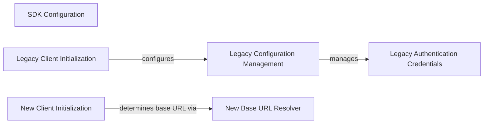

## Component Details

This graph illustrates the core components involved in the Square SDK's configuration and client initialization, encompassing both legacy and modern client architectures. The main flow involves the initialization of clients, which in turn rely on dedicated configuration management and base URL resolution components to set up the necessary operational parameters and authentication credentials for API interactions.

### SDK Configuration
Manages the SDK's global settings, including authentication credentials, environment selection, and HTTP client configurations for both legacy and modern clients.

**Related Classes/Methods**:

- <a href="https://github.com/square/square-python-sdk/blob/master/legacy/src/square_legacy/configuration.py#L10-L182" target="_blank" rel="noopener noreferrer">`square_legacy.configuration.Configuration` (10:182)</a>
- <a href="https://github.com/square/square-python-sdk/blob/master/src/square/client.py#L277-L283" target="_blank" rel="noopener noreferrer">`square.client._get_base_url` (277:283)</a>
- <a href="https://github.com/square/square-python-sdk/blob/master/src/square/environment.py#L6-L8" target="_blank" rel="noopener noreferrer">`square.environment.SquareEnvironment` (6:8)</a>

### Legacy Client Initialization
This component handles the initialization of the legacy Square SDK client, primarily by configuring the SDK's operational parameters and setting up authentication.

**Related Classes/Methods**:

- <a href="https://github.com/square/square-python-sdk/blob/master/legacy/src/square_legacy/client.py#L235-L269" target="_blank" rel="noopener noreferrer">`square_legacy.client.Client:__init__` (235:269)</a>

### Legacy Configuration Management
This component is responsible for managing the SDK's configuration, including environment settings, custom URLs, access tokens, and HTTP client parameters. It also handles the creation and validation of authentication credentials and the HTTP client.

**Related Classes/Methods**:

- <a href="https://github.com/square/square-python-sdk/blob/master/legacy/src/square_legacy/configuration.py#L42-L80" target="_blank" rel="noopener noreferrer">`square_legacy.configuration.Configuration:__init__` (42:80)</a>
- <a href="https://github.com/square/square-python-sdk/blob/master/legacy/src/square_legacy/configuration.py#L82-L116" target="_blank" rel="noopener noreferrer">`square_legacy.configuration.Configuration:clone_with` (82:116)</a>
- <a href="https://github.com/square/square-python-sdk/blob/master/legacy/src/square_legacy/configuration.py#L168-L182" target="_blank" rel="noopener noreferrer">`square_legacy.configuration.Configuration.create_auth_credentials_object` (168:182)</a>
- <a href="https://github.com/square/square-python-sdk/blob/master/legacy/src/square_legacy/configuration.py#L162-L165" target="_blank" rel="noopener noreferrer">`square_legacy.configuration.Configuration.validate_user_agent` (162:165)</a>
- <a href="https://github.com/square/square-python-sdk/blob/master/legacy/src/square_legacy/configuration.py#L118-L126" target="_blank" rel="noopener noreferrer">`square_legacy.configuration.Configuration.create_http_client` (118:126)</a>

### Legacy Authentication Credentials
This component is responsible for creating and managing bearer authentication credentials used for API requests within the legacy SDK.

**Related Classes/Methods**:

- <a href="https://github.com/square/square-python-sdk/blob/master/legacy/src/square_legacy/http/auth/o_auth_2.py#L25-L37" target="_blank" rel="noopener noreferrer">`square_legacy.http.auth.o_auth_2.BearerAuthCredentials` (25:37)</a>

### New Client Initialization
This component handles the initialization of the new Square SDK client, focusing on determining the base URL for API calls.

**Related Classes/Methods**:

- <a href="https://github.com/square/square-python-sdk/blob/master/src/square/client.py#L117-L175" target="_blank" rel="noopener noreferrer">`square.client.Square:__init__` (117:175)</a>
- <a href="https://github.com/square/square-python-sdk/blob/master/src/square/client.py#L216-L274" target="_blank" rel="noopener noreferrer">`square.client.AsyncSquare:__init__` (216:274)</a>

### New Base URL Resolver
This component is responsible for resolving the base URL for the new Square SDK client, which is crucial for directing API requests to the correct endpoint.

**Related Classes/Methods**:

- <a href="https://github.com/square/square-python-sdk/blob/master/src/square/client.py#L277-L283" target="_blank" rel="noopener noreferrer">`square.client._get_base_url` (277:283)</a>

### [FAQ](https://github.com/CodeBoarding/GeneratedOnBoardings/tree/main?tab=readme-ov-file#faq)