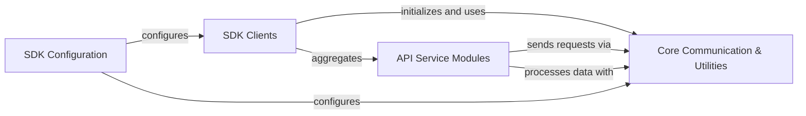

## Component Details

The `square-python-sdk` architecture is designed around a clear separation of concerns, primarily distinguishing between legacy and modern SDK clients. The modern SDK offers both synchronous and asynchronous interfaces, all of which rely on a robust `Core Communication & Utilities` layer for HTTP requests, data handling, error management, and pagination. Specific Square API functionalities are encapsulated within `API Service Modules`, which interact with the core communication layer. Global settings and authentication are managed by the `SDK Configuration` component, which influences the behavior of both the SDK clients and the underlying communication mechanisms.

### SDK Clients
The primary entry points for interacting with the Square API, providing both synchronous and asynchronous interfaces for the modern SDK, and a single client for the legacy SDK. These clients aggregate various API-specific modules.

**Related Classes/Methods**:

- <a href="https://github.com/square/square-python-sdk/blob/master/legacy/src/square_legacy/client.py#L55-L269" target="_blank" rel="noopener noreferrer">`square_legacy.client.Client` (55:269)</a>
- <a href="https://github.com/square/square-python-sdk/blob/master/src/square/client.py#L79-L175" target="_blank" rel="noopener noreferrer">`square.client.Square` (79:175)</a>
- <a href="https://github.com/square/square-python-sdk/blob/master/src/square/client.py#L178-L274" target="_blank" rel="noopener noreferrer">`square.client.AsyncSquare` (178:274)</a>

### Core Communication & Utilities
Provides the foundational services for the SDK, including executing HTTP requests, handling data serialization/deserialization, managing API-specific errors, and facilitating pagination for API responses.

**Related Classes/Methods**:

- <a href="https://github.com/square/square-python-sdk/blob/master/src/square/core/http_client.py#L148-L321" target="_blank" rel="noopener noreferrer">`square.core.http_client.HttpClient` (148:321)</a>
- <a href="https://github.com/square/square-python-sdk/blob/master/src/square/core/http_client.py#L324-L497" target="_blank" rel="noopener noreferrer">`square.core.http_client.AsyncHttpClient` (324:497)</a>
- <a href="https://github.com/square/square-python-sdk/blob/master/src/square/core/client_wrapper.py#L9-L46" target="_blank" rel="noopener noreferrer">`square.core.client_wrapper.BaseClientWrapper` (9:46)</a>
- <a href="https://github.com/square/square-python-sdk/blob/master/src/square/core/client_wrapper.py#L49-L65" target="_blank" rel="noopener noreferrer">`square.core.client_wrapper.SyncClientWrapper` (49:65)</a>
- <a href="https://github.com/square/square-python-sdk/blob/master/src/square/core/client_wrapper.py#L68-L84" target="_blank" rel="noopener noreferrer">`square.core.client_wrapper.AsyncClientWrapper` (68:84)</a>
- `square.core.query_encoder` (full file reference)
- `square.core.file` (full file reference)
- <a href="https://github.com/square/square-python-sdk/blob/master/src/square/core/remove_none_from_dict.py#L6-L11" target="_blank" rel="noopener noreferrer">`square.core.remove_none_from_dict` (6:11)</a>
- <a href="https://github.com/square/square-python-sdk/blob/master/src/square/core/unchecked_base_model.py#L36-L124" target="_blank" rel="noopener noreferrer">`square.core.unchecked_base_model.UncheckedBaseModel` (36:124)</a>
- <a href="https://github.com/square/square-python-sdk/blob/master/src/square/core/jsonable_encoder.py#L31-L100" target="_blank" rel="noopener noreferrer">`square.core.jsonable_encoder` (31:100)</a>
- `square.core.serialization` (full file reference)
- `square.core.pydantic_utilities` (full file reference)
- `square.core.datetime_utils` (full file reference)
- <a href="https://github.com/square/square-python-sdk/blob/master/src/square/core/api_error.py#L14-L123" target="_blank" rel="noopener noreferrer">`square.core.api_error.ApiError` (14:123)</a>
- <a href="https://github.com/square/square-python-sdk/blob/master/src/square/core/pagination.py#L37-L62" target="_blank" rel="noopener noreferrer">`square.core.pagination.SyncPager` (37:62)</a>
- <a href="https://github.com/square/square-python-sdk/blob/master/src/square/core/pagination.py#L65-L87" target="_blank" rel="noopener noreferrer">`square.core.pagination.AsyncPager` (65:87)</a>

### API Service Modules
A collection of specialized client modules, each dedicated to a specific Square API category (e.g., Payments, Bookings, Customers). These modules encapsulate the business logic for interacting with their respective API endpoints.

**Related Classes/Methods**:

- <a href="https://github.com/square/square-python-sdk/blob/master/src/square/o_auth/client.py#L17-L312" target="_blank" rel="noopener noreferrer">`square.o_auth.client.OAuthClient` (17:312)</a>
- `square.payments.client.PaymentsClient` (full file reference)
- `square.bookings.client.BookingsClient` (full file reference)
- `square.catalog.client.CatalogClient` (full file reference)
- `square.customers.client.CustomersClient` (full file reference)
- `square.subscriptions.client.SubscriptionsClient` (full file reference)
- <a href="https://github.com/square/square-python-sdk/blob/master/src/square/locations/client.py#L29-L429" target="_blank" rel="noopener noreferrer">`square.locations.client.LocationsClient` (29:429)</a>
- <a href="https://github.com/square/square-python-sdk/blob/master/src/square/terminal/client.py#L20-L139" target="_blank" rel="noopener noreferrer">`square.terminal.client.TerminalClient` (20:139)</a>
- <a href="https://github.com/square/square-python-sdk/blob/master/src/square/webhooks/client.py#L13-L29" target="_blank" rel="noopener noreferrer">`square.webhooks.client.WebhooksClient` (13:29)</a>
- `square.inventory.client.InventoryClient` (full file reference)
- <a href="https://github.com/square/square-python-sdk/blob/master/src/square/team_members/client.py#L26-L419" target="_blank" rel="noopener noreferrer">`square.team_members.client.TeamMembersClient` (26:419)</a>
- `square.orders.client.OrdersClient` (full file reference)

### SDK Configuration
Manages the SDK's global settings, including authentication credentials, environment selection, and HTTP client configurations for both legacy and modern clients.

**Related Classes/Methods**:

- <a href="https://github.com/square/square-python-sdk/blob/master/legacy/src/square_legacy/configuration.py#L10-L182" target="_blank" rel="noopener noreferrer">`square_legacy.configuration.Configuration` (10:182)</a>
- <a href="https://github.com/square/square-python-sdk/blob/master/src/square/client.py#L277-L283" target="_blank" rel="noopener noreferrer">`square.client._get_base_url` (277:283)</a>
- <a href="https://github.com/square/square-python-sdk/blob/master/src/square/environment.py#L6-L8" target="_blank" rel="noopener noreferrer">`square.environment.SquareEnvironment` (6:8)</a>

### [FAQ](https://github.com/CodeBoarding/GeneratedOnBoardings/tree/main?tab=readme-ov-file#faq)